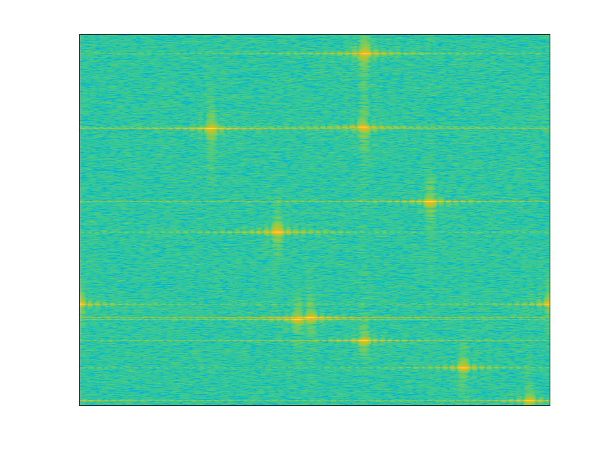

# DRFM
 <h1 align="center">
  <a href="https://github.com/dec0dOS/amazing-github-template">
    
  </a>
</h1>

<div align="center">
  <br />
  <br />
  <a href="https://github.com/friedele/DRFM_Project//issues/new?assignees=&labels=bug&template=01_BUG_REPORT.md&title=bug%3A+">Report a Bug</a>
  ·
  <a href="https://github.com/friedele/DRFM_Project/issues/new?assignees=&labels=enhancement&template=02_FEATURE_REQUEST.md&title=feat%3A+">Request a Feature</a>
  .
  <a href="https://github.com/friedele/DRFM_Project/discussions">Ask a Question</a>
</div>

<div align="center">
<br />

[](LICENSE)

[](https://github.com/dec0dOS/amazing-github-template/issues?q=is%3Aissue+is%3Aopen+label%3A%22help+wanted%22)
[](https://github.com/dec0dOS)

</div>

<details open="open">
<summary>Table of Contents</summary>

- [About](#about)
  - [Built With](#built-with)
- [Getting Started](#getting-started)
  - [Prerequisites](#prerequisites)
  - [Usage](#usage)
    - [template](#example-template)
    - [Manual setup](#manual-setup)
    - [Variables reference]
- [Roadmap](#roadmap)
- [Contributing](#contributing)
- [Support](#support)
- [License](#license)
- [Acknowledgements](#acknowledgements)

</details>

---

## About

<table>
<tr>
<td>

Radar electronic jammers are evolving from hostile nations thus becoming more complex and present serious issues when a radar system is trying to interrogate the actual targets of interest. Electronic jammers that present a serious challenge are in a class called Digital Radio Frequency Memory (DRFM).  DRFM techniques work by generating coherent false targets to the radar receiver based on an intercepted pulse signal from the radar transmitter. This will position false targets either ahead or behind the actual radar target, thus masking the real target with false targets.  The false targets can also be manipulated in amplitude, phase and frequency.

Traditional approaches to target detection and estimation for electronic jammers in general, rely on parametric modeling, that can fail because it violates the strict assumptions of classical signal processing algorithms. The result is substantial algorithm performance degradation. Furthermore parametric models to handle DRFM jammers are difficult to design and ineffective against an evolving DRFM technology.   The key to identifying opportunities for improved electronic jammer protection and signal processing in radars is to use machine learning techniques to challenge the underlying assumptions of the standard parametric approach for the design and analysis of radar systems. 

Convolutional Neural Networks (CNN) have gained popularity in the last few years with the advent of faster high performance computer systems which rely GPUs for the best computational performance.  A CNN operates from a mathematical perspective and is used for non-trivial tasks such as image classification. CNN's have great performance while classifying images when they are very similar to the training dataset. However little work as been done in developing realistic radar models which are ignoring radar environmental and antenna effects thus providing inaccurate simulation training datasets and credibility.  In addition, current public available research does not typically consider the five dimensions of a radar sensor, thus presenting an incomplete signal processing chain. From a first principles perspective the radar measures the following aspects of a signal target return:  Range, azimuth, elevation, Doppler, and signal amplitude. 

We propose to design a CNN that will use both temporal and spatial training datasets, where the radar signal processing with respect to DRFM jamming will be examined to identify and classify DRFM type jammers.  The CNN will use raw uncompressed In-phase and Quadrature (IQ) time series data and range-doppler maps as inputs to classify if our ground based phased array radar system is being jammed by DRFM false targets.   A suitable network architecture and values for hyperparameters are found by iterative experimental studies. The final classification accuracy objective will be 95 percent or better. This achieved accuracy suggests that CNNs can be used to detect radar DRFM jamming with good results and thus allowing a radar system to decide on any further actions to mitigate a DRFM jammer attack.


<details open>
<summary>Additional info</summary>
<br>

This project is the result of huge research. 

</details>

</td>
</tr>
</table>

## Getting Started

### Prerequisites

The recommended method to install 

```sh
This will give you the large highlight bar
```

For other install options, please refer to [Cookiecutter installation manual](https://cookiecutter.readthedocs.io/en/latest/installation.html).

### Usage


#### Manual setup

Please follow these steps for manual setup:

1. [Download the precompiled template](https://github.com/dec0dOS/amazing-github-template/releases/download/latest/template.zip)
2. Replace all the [variables](#variables-reference) to your desired values
3. Initialize the repo in the precompiled template folder

    `or`

    Move the necessary files from precompiled template folder to your existing project directory. Don't forget the `use backticks to get this type of display` directory that may be hidden by default in your operating system

#### Variables reference

Please note that entered values are case-sensitive.
Default values are provided as an example to help you figure out what should be entered.

| Name                       | Default value      | Description                                                                 |
| -------------------------- | ------------------ | --------------------------------------------------------------------------- |
| PROJECT_NAME               | My Amazing Project | Your project name                                                           |
| REPO_SLUG                  | my-amazing-project | Repo slug must match the GitHub repo URL slug part                          |
| GITHUB_USERNAME            | dec0dOS            | Your GitHub username **without @**                                          |
| FULL_NAME                  | Alexey Potapov     | Your full name                                                              |
| OPEN_SOURCE_LICENSE        | MIT license        | Full OSS license name                                                       |
| modern_header              | y                  | Use HTML to prettify your header                                            |
| table_in_about             | n                  | Use table to wrap around About section                                      |
| include_logo               | y                  | Include Logo section. Only valid when `modern_header == y`          |
| include_badges             | y                  | Include section for badges                                                  |
| include_toc                | y                  | Include Table of Contents                                                   |
| include_screenshots        | y                  | Include Screenshots section                                                 |
| include_project_assistance | y                  | Include Project assistance section                                          |
| include_authors            | y                  | Include Authors & contributors section                                      |
| include_security           | y                  | Include Security section and SECURITY.md file                               |
| include_acknowledgements   | y                  | Include Acknowledgements section                                            |
| include_code_of_conduct    | y                  | Include CODE_OF_CONDUCT.md file                                             |
| include_workflows          | y                  | Include .github/workflows directory                                         |
| use_codeql                 | y                  | Use [CodeQL](https://securitylab.github.com/tools/codeql/)                  |
| use_conventional_commits   | y                  | Add [Conventional Commits](https://www.conventionalcommits.org) notice      |
| use_github_discussions     | n                  | Use [GitHub Discussions](https://docs.github.com/en/discussions/quickstart) |

> NOTICE: Grays out the text.

## Roadmap

See the [open issues](https://github.com/dec0dOS/amazing-github-template/issues) for a list of proposed features (and known issues).

- [Top Feature Requests](https://github.com/dec0dOS/amazing-github-template/issues?q=label%3Aenhancement+is%3Aopen+sort%3Areactions-%2B1-desc) (Add your votes using the 👍 reaction)
- [Top Bugs](https://github.com/dec0dOS/amazing-github-template/issues?q=is%3Aissue+is%3Aopen+label%3Abug+sort%3Areactions-%2B1-desc) (Add your votes using the 👍 reaction)
- [Newest Bugs](https://github.com/dec0dOS/amazing-github-template/issues?q=is%3Aopen+is%3Aissue+label%3Abug)

## Contributing


Please try to create bug reports that are:

- _Reproducible._ Include steps to reproduce the problem.
- _Specific._ Include as much detail as possible: which version, what environment, etc.
- _Unique._ Do not duplicate existing opened issues.
- _Scoped to a Single Bug._ One bug per report.

## Support

Reach out to the maintainer at one of the following places:

- [GitHub discussions](https://github.com/dec0dOS/amazing-github-template/discussions)
- The email which is located [in GitHub profile](https://github.com/friedele)

## License

This project is licensed under the **MIT license**. Feel free to edit and distribute this template as you like.

See [LICENSE](LICENSE) for more information.

## Acknowledgements

Resources that were used during the development of the **DRFM-Project**:

- <https://github.com/cookiecutter/cookiecutter>
